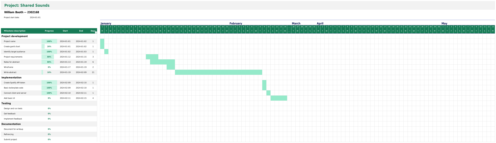

# Melody Merge

## Table of Contents

- [Gantt Chart](#gantt-chart)
- [Abstract](#abstract)
- [Introduction](#introduction)
  - [Project Requirements](#project-requirements)
  - [Limitations](#limitations)
  - [Research into Existing Solutions](#research-into-existing-solutions)
    - [Shared Spotify](#shared-spotify)
- [Development](#development)
  - [Server Setup](#server-setup)
    - [Socket.io](#socketio)
- [References](#references)

## Gantt Chart



## Abstract

Spotify is A music streaming service that has over 500 million active users worldwide and has a market share of over 50% in the UK (Competition and Markets Authority, 2023). The service allows users to listen to music for free with ads or pay for a premium subscription that removes ads and allows users to download music for offline listening (Spotify, n.d.-a). The service also allows users to create and share playlists with other users. However, there is no way to compare the music data of two or more users and create a playlist with the songs that they have in common.

Melody Merge is a web application that will allow two or more users to sign in with their Spotify account. When the users have signed in, they will be able to see the songs that they have in common. The application will also allow the users to create a playlist with those songs. The application will use the Spotify API to authenticate users and access their music data. The server will be created using Node.js and Express.js, and the real-time connection between the clients and the server will be handled using Socket.io.

The aim of this project is to create a web application that will allow users to compare their music data and create a playlist with the songs that they have in common. The application will be useful for users who want to discover new music that they have in common with their friends or family members.

## Introduction

### Project Requirements

- A functional web application that allows users to sign in with their Spotify account.
- A server that will handle the real-time connection between the clients and the server.
- A way to sign in and out of the application.
- A way to access the user's music data from Spotify.
- A way to compare the music data of two or more users.
- A way to create a playlist with the songs that the users have in common as well as the ability to rename the playlist and add cover art.
- If no cover art is provided, the application will combine the profile picture of the users.
- A way to switch between light and dark mode.

### Limitations

- The application will only work with Spotify accounts; accounts with other platforms like Apple Music or Tidal will not work.
- During development, the app will be in development mode. This limits the number of users to 25 and those users need to manually added to the allow list (Spotify, n.d.-b).

### Research into Existing Solutions

#### Shared Spotify

There is not a way to do what this project will solve using first-party software, however, there is an open-source third-party website developed by Paul Vidal called Shared Spotify that allows users to join a room and compare their music data to create a playlist with the songs that they have in common and works with both Spotify and Apple Music. It was make with Go for the backend, JavaScript for the frontend, and hosted with AWS. Shared Spotify does not allow the user to make a custom title or add a cover image -- instead generating one automatically. The website adds all of the songs to a playlist instead of letting the user choose what should and should not get added (Vildal, 2021).

## Development

### Server Setup

For this project, I will be using NodeJS and ExpressJS to create the server. To start, I will create a new directory and run `npm init -y` to create a new `package.json` file. I will then install the required dependencies using `npm install express socket.io`.

```js
const express = require("express");
const app = express();
const fs = require("fs");
const path = require("path");
const server = require("http").createServer(app);
const io = require("socket.io")(server);
```

This code will import the required modules and create a new Express app. It will also create a new HTTP server using the Express app and create a new Socket.io server using the HTTP server.

The server can either listen on port 8080 or the user can specify a port when starting the server.

```js
let port = process.argv[2] || 8080;
server.listen(port);
```

To provide the client with the required files, I will create a new directory called `public` and add the required files to it.

```js
app.use(express.static("public"));

app.get("/", (req, res) => {
  res.status(200).res.sendFile(path.join(__dirname, "public", "index.html"));
});
```

When the client connects to the server and sends a `GET` request to the root URL, the server will send the `index.html` file to the client.

#### Socket.io

To handle the real-time connection between the clients and the server, I will use Socket.io. I will create a new event called `connection` that will be triggered when a client connects to the server.

```js
io.on("connection", (socket) => {
  console.log(socket.id);
});
```

On the client side, I will create a new Socket.io client and connect it to the server.

```js
let socket = io.connect(location.host, {transports: ["websocket"]});
```

Each time a client connects to the server, a new socket ID will be generated and logged to the console.

```text
[user@thinkpad com3103-projects-2023-24-booth-w]$ node app.js
RBXy_47EwW0A7ZAIAAAB
SZtiEIte23tHpPGgAAAD
_DfJjVNzntmOxbadAAAF
```

## References

Competition and Markets Authority. (2023, November 29). _Music and streaming final report_. <https://assets.publishing.service.gov.uk/media/6384f43ee90e077898ccb48e/Music_and_streaming_final_report.pdf>

Spotify. (n.d.-a). _About Spotify_. <https://newsroom.spotify.com/company-info/>

Spotify. (n.d.-b). _Quota modes_. <https://developer.spotify.com/documentation/web-api/concepts/quota-modes/>

Vildal, P. (2021, April). _Shared Spotify_. GitHub. <https://github.com/paulvidal/shared-spotify/>
