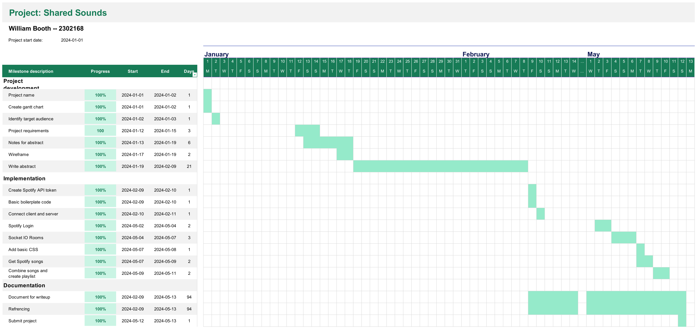
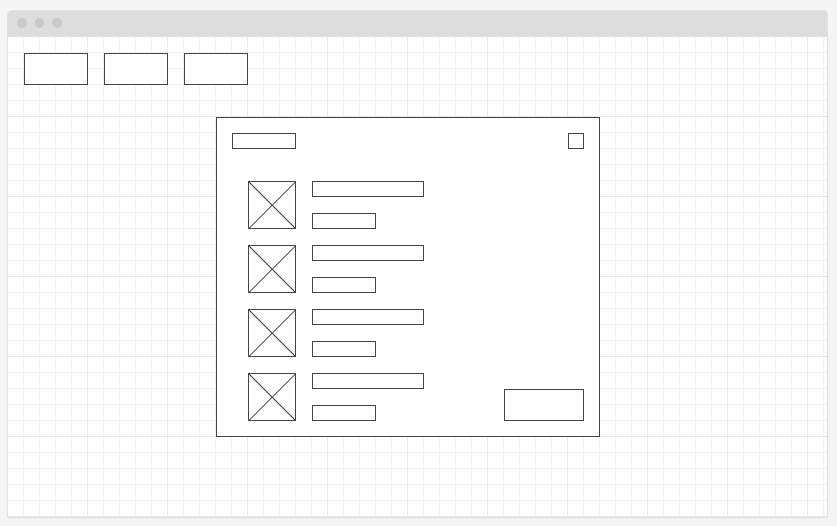
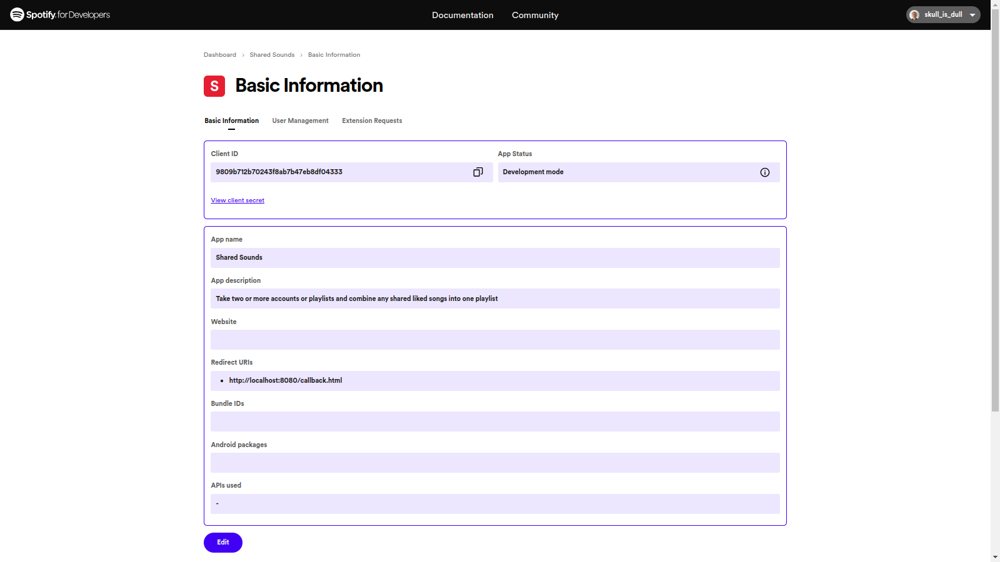
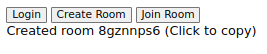
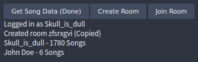
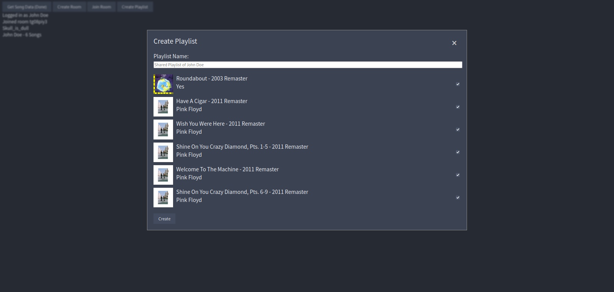
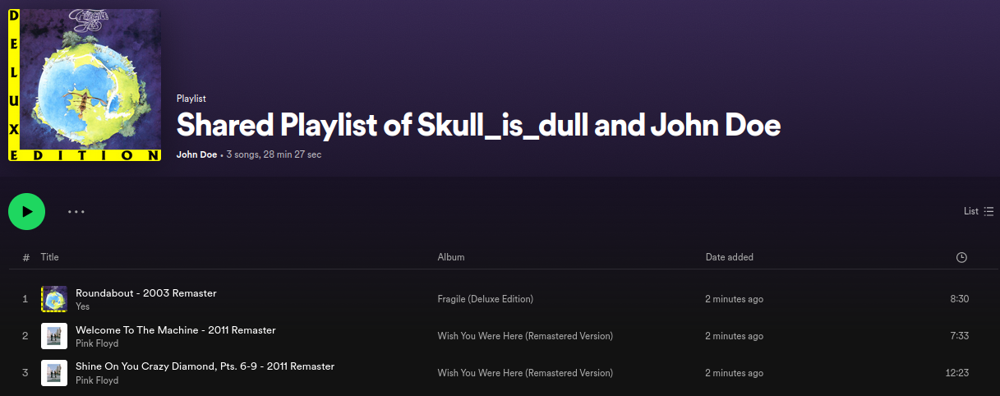

# Melody Merge

## Table of Contents

- [Gantt Chart](#gantt-chart)
- [Abstract](#abstract)
- [Wireframe](#wireframe)
- [Introduction](#introduction)
  - [Project Requirements](#project-requirements)
  - [Limitations](#limitations)
  - [Research into Existing Solutions](#research-into-existing-solutions)
    - [Shared Spotify](#shared-spotify)
  - [Legal and Ethical](#legal-and-ethical)
- [Development](#development)
  - [Server Setup](#server-setup)
    - [Socket.io](#socketio)
  - [Spotify API](#spotify-api)
  - [Socket.io Rooms](#socketio-rooms)
    - [Creating a Room](#creating-a-room)
    - [Joining a Room](#joining-a-room)
  - [CSS](#css)
    - [Nord Theme](#nord-theme)
  - [Getting Spotify Data](#getting-spotify-data)
  - [Room member list](#room-members-list)
  - [Create Playlist](#create-playlist)
- [Conclusion](#conclusion)
- [References](#references)

## Gantt Chart



## Abstract

Spotify is A music streaming service that has over 500 million active users worldwide and has a market share of over 50% in the UK (Competition and Markets Authority, 2023). The service allows users to listen to music for free with ads or pay for a premium subscription that removes ads and allows users to download music for offline listening (Spotify, n.d.-a). The service also allows users to create and share playlists with other users. However, there is no way to compare the music data of two or more users and create a playlist with the songs that they have in common.

Melody Merge is a web application that will allow two or more users to sign in with their Spotify account. When the users have signed in, they will be able to see the songs that they have in common. The application will also allow the users to create a playlist with those songs. The application will use the Spotify API to authenticate users and access their music data. The server will be created using Node.js and Express.js, and the real-time connection between the clients and the server will be handled using Socket.io.

The aim of this project is to create a web application that will allow users to compare their music data and create a playlist with the songs that they have in common. The application will be useful for users who want to discover new music that they have in common with their friends or family members.

## Wireframe



## Introduction

### Project Requirements

- A functional web application that allows users to sign in with their Spotify account.
- A server that will handle the real-time connection between the clients and the server.
- A way to sign in and out of the application.
- A way to access the user's music data from Spotify.
- A way to compare the music data of two or more users.
- A way to create a playlist with the songs that the users have in common as well as the ability to rename the playlist and add cover art.

### Limitations

- The application will only work with Spotify accounts; accounts with other platforms like Apple Music or Tidal will not work.
- During development, the app will be in development mode. This limits the number of users to 25 and those users need to manually added to the allow list (Spotify, n.d.-b). If I want to allow anyone to use the app, I will need to apply for an extended quota which will need to be reviewed by Spotify to ensure that the app is not using the API in a way that goes against the Terms of Service.

### Research into Existing Solutions

#### Shared Spotify

There is not a way to do what this project will solve using first-party software, however, there is an open-source third-party website developed by Paul Vidal called Shared Spotify that allows users to join a room and compare their music data to create a playlist with the songs that they have in common and works with both Spotify and Apple Music. It was make with Go for the backend, JavaScript for the frontend, and hosted with AWS. Shared Spotify does not allow the user to make a custom title or add a cover image -- instead generating one automatically. The website adds all of the songs to a playlist instead of letting the user choose what should and should not get added (Vildal, 2021).

### Legal and Ethical

- The application must comply with the Spotify Developer Terms of Service (Spotify, 2023a) and the Spotify Developer Policy (Spotify, 2023b). This includes not using the Spotify API to create a competing music streaming service, not using the Spotify API to create a service that allows users to download music for offline listening, and not using the Spotify API to create a service that allows users to listen to music without ads.
- The application must also comply with the General Data Protection Regulation (GDPR) and the Data Protection Act (2018). This means user's data must not be stored for longer than necessary, must be stored securely, and must not be shared with third parties without the user's consent.

## Development

### Server Setup

For this project, I will be using NodeJS and ExpressJS to create the server. To start, I will create a new directory and run `npm init -y` to create a new `package.json` file. I will then install the required dependencies using `npm install express socket.io`.

```js
const express = require("express");
const app = express();
const fs = require("fs");
const path = require("path");
const server = require("http").createServer(app);
const io = require("socket.io")(server);
```

This code will import the required modules and create a new Express app. It will also create a new HTTP server using the Express app and create a new Socket.io server using the HTTP server.

The server can either listen on port 8080 or the user can specify a port when starting the server.

```js
let port = process.argv[2] || 8080;

// validate port
if (isNaN(port) || port < 1 || port > 65535) {
  console.log("Invalid port");
  process.exit(1);
}

server.listen(port);

// check if port is in use
server.on("error", (err) => {
  if (err.code == "EADDRINUSE") {
    console.log(`Port ${port} is in use`);
  }
});
```

If the user specifies a port, it is then checked to see if it is a valid port number. If it is not, an error will be thrown and the process will exit. The server listens for an error. If the code of the error it catches is `EADDRINUSE`, it will print to the console that the port is in use.

To provide the client with the required files, I will create a new directory called `public` and add the required files to it.

```js
app.use(express.static("public"));

app.get("/", (req, res) => {
  res.status(200).res.sendFile(path.join(__dirname, "public", "index.html"));
});
```

When the client connects to the server and sends a `GET` request to the root URL, the server will send the `index.html` file to the client.

#### Socket.io

To handle the real-time connection between the clients and the server, I will use Socket.io. I will create a new event called `connection` that will be triggered when a client connects to the server.

```js
io.on("connection", (socket) => {
  console.log(socket.id);
});
```

On the client side, I will create a new Socket.io client and connect it to the server.

```js
let socket = io.connect(location.host, {transports: ["websocket"]});
```

Each time a client connects to the server, a new socket ID will be generated and logged to the console.

```text
[user@thinkpad com3103-projects-2023-24-booth-w]$ node app.js
RBXy_47EwW0A7ZAIAAAB
SZtiEIte23tHpPGgAAAD
_DfJjVNzntmOxbadAAAF
```

### Spotify API

To access the user's music data from Spotify, I will use the Spotify API. To do this, I will need to create a new Spotify application and get the client ID. I will also need to create a new redirect URI that will be used to redirect the user back to the application after they have signed in with their Spotify account.



On the HTML page, there is a login button. When the user clicks on the button, they will be redirected to the Spotify login page.

```html
<button id="login">Login</button>
```

```js
$("#login").click(() => {
  let scopes = ["user-library-read"];
  let redirectURL = `https://accounts.spotify.com/authorize?client_id=${CLIENT_ID}&show_dialog=true&redirect_uri=${encodeURIComponent(location.href+"callback.html")}&scope=${encodeURIComponent(scopes.join(" "))}&response_type=token`;
  window.open(redirectURL, "");
});
```

The user will be logged in using OAuth2.0 and will be redirected back to the application with an access token.
`scopes` defines the permissions the token will have. In this case, the token will have read access to the user's library.
The `redirectURL` is the URL that the user will be redirected to that will allow the user to login with their Spotify account.
The URL has five parameters:

- `client_id` is the client ID of the Spotify application.
- `show_dialog` is set to `true` to show the login dialogue.
- `redirect_uri` is the URL that the user will be redirected to after they have signed in with their Spotify account. In this case, it is /callback.html.
- `scope` is for the permissions that the token will have.
- `response_type` is set to `token` to get an access token.

If the user is successfully logged in, they will be redirected to the callback page.

```html
<!DOCTYPE html>
<html>
  <head>
    <script>
      (() => {
        let hash = {};
        window.location.hash.replace(/^#\/?/, "").split("&").forEach(parameter => {
          let key = parameter.split("=")[0];
          let value = parameter.split("=")[1];
          hash[key] = value;
        });
        
        if (hash.access_token) {
          window.opener.postMessage(JSON.stringify({
            type: "access_token",
            access_token: hash.access_token,
            expires_in: hash.expires_in || 0
          }), location.origin+"/index.html");
          window.close();
        }
      })();
    </script>
  </head>
</html>
```

`window.location.hash` with return the part of the URL after and including the `#`. `replace` removes the `#` from the string and a `/` from the start if there is one. `split` will split the string into an array of strings at each `&`. `forEach` will loop through each element in the array. `split` will split the string into an array of strings at each `=` with the key being the first element in the array and the value being the second element in the array. The key and value is then added to the `hash` object.

If the `access_token` is in the hash object, a message will be sent to `/index.html` with the access token and the expires in time. The window will then close.

`index.html` will be listening for the `message` event. When the event is triggered, the access token will be used to get the user's name and print it to the page. This is done to confirm that the callback function has been implemented correctly and will be removed in later versions.

```js
window.addEventListener("message", async (e) => {
  let hash = JSON.parse(e.data);
  if (hash.type == "access_token") {
    token = hash.access_token;
    addUser(token);
  }
}, false);
```

```js
async function addUser(token) {
  let name = await fetch("https://api.spotify.com/v1/me", {
    method: "GET",
    headers: {
      "Authorization": `Bearer ${token}`
    }
  }).then((res) => res.json()).then((data) => data.display_name);
  $("button").remove();
  $("body").append(`${name}: ${token}`);
}
```

### Socket.io Rooms

To know which users to compare the music data of, I will create a new room for each group of users. When a user connects to the server, they will be asked to either create or join a room. If the user creates a room, they will be given a room code that they can share with other users. If the user joins a room, they will be asked to enter the room code that they have been given.

#### Creating a Room

When the user creates a room, the server will generate an 8-character room code that is unique to the server. If the ID exists, the server will continuously generate a new ID until it is unique.

When the server creates a room, it sends back the ID to the client. The client will then append the ID to the body of the page and allow the user to copy the ID to the clipboard by clicking on it.

Client

```js
$("#createRoom").click(() => {
  socket.emit("create").on("create res", (room) => {
    $(".room-notice").html(`<div class="room-create-notice">Created room ${room} (Click to copy)</div>`);
    $(".room-create-notice").click(() => {
      navigator.clipboard.writeText(room);
      $(".room-create-notice").text(`Created room ${room} (Copied)`);
    });
  });
});
```

Server

```js
io.on("connection", (socket) => {
  socket.on("create", (room) => {
    let ID;
    do {
      ID = Array(8).fill().map(() => "0123456789abcdefghigklmnopqrstuvwxyz"[Math.floor(Math.random() * 36)]).join("");
    } while (io.sockets.adapter.rooms.has(ID));
    
    socket.join(ID);
    socket.emit("create res", ID);
    console.log(`Socket ${socket.id} created room ${room}`);
  });
});
```



#### Joining a Room

When the user joins a room, the server will check if the room exists. If the room exists, the user will be added to the room. If the room does not exist, the user will be sent an error message.

Client

```js
$("#joinRoom").click(() => {
  let room = prompt("Enter room ID");

  if (room == null) return;
  if (!/^[a-z0-9]{8}$/.test(room)) {
    alert("Invalid room ID");
    return;
  }

  socket.emit("join", room).on("join res", (res) => {
    if (res == "success") {
      $(".room-notice").text(`Joined room ${room}`);
    } else {
      $(".room-notice").text(`Failed to join room ${room}`);
    }
  });
});
```

Before sending the room ID to the server, the client will check if the room ID could exist by checking it against the regular expression `/^[a-z0-9]{8}$/`. This will check if the room ID is 8 characters long and only contains lowercase letters and numbers.

If the room number is valid, it will be sent to the server and the server will check if the room exists or not

Server

```js
socket.on("join", (room) => {
  if (io.sockets.adapter.rooms.has(room)) {
    socket.join(room);
    socket.emit("join res", "success");
    console.log(`Socket ${socket.id} joined room ${room}`);
  } else {
    socket.emit("join res", "fail");
    console.log(`Socket ${socket.id} failed to join room ${room}`);
  }
});
```

### CSS

```css
:root {
  --bg-primary: #2E3440;
  --bg-secondary: #3B4252;
  --text-primary: #ECEFF4;
  --button-primary: #434C5E;
  --button-secondary: #4C566A;
}

body {
  background-color: var(--bg-primary);
  color: var(--text-primary);
  font-family: "Source Sans Pro", serif;
}

button {
  background-color: var(--button-primary);
  color: var(--text-primary);
  border: none;
  padding: 0.5rem 1rem;
  cursor: pointer;
}
button:hover {
  background-color: var(--button-secondary);
}

.room-create-notice {
  cursor: pointer;
}
```

For this website, I will be using the font Source Sans Pro. To use the font, I will add the following link to the head of the HTML file:

```html
<link href="https://fonts.googleapis.com/css2?family=Source+Sans+Pro&display=swap" rel="stylesheet">
```

#### Nord Theme

The colours used will be from the Nord theme. The Nord theme is a color scheme that is used in many popular applications like Visual Studio Code, Vim, and Emacs (Nord, n.d.). It also has a GTK theme -- a cross-platform widget toolkit for creating graphical user interfaces (Lara, 2024).

### Getting Spotify Data

To get the user's music data, I will use the Spotify API. The API has an endpoint that will return the user's saved tracks. The endpoint is `https://api.spotify.com/v1/me/tracks` (Spotify, n.d.-c). This returns a list of up to 50 tracks that the user has saved. It is not possible to get more than 50 tracks at a time so the response is not too large. Because of this, the response includes a url with an offset to get the next 50 tracks.

Client

```js
async function addUser(token) {
  let [userID, name] = await fetch("https://api.spotify.com/v1/me", {
    method: "GET",
    headers: {
      "Authorization": `Bearer ${token}`
    }
  }).then((res) => res.json()).then((data) => [data.id, data.display_name]);

  $(".login-notice").text(`Logged in as ${name}`);
  
  // replace login button with get song data button
  $("#login").replaceWith(`<button id="getSongData">Get Song Data</button>`);
  $("#getSongData").click(async () => {
    let songs = await getSongs(token, `https://api.spotify.com/v1/me/tracks?limit=50`)
    $("#getSongData").text("Get Song Data (Done)");
    socket.emit("song data", [userID, songs]);
  });
}

async function getSongs(token, url, songs = []) {
  return await fetch(url, {
    "method": "GET",
    "headers": {
      "Authorization": `Bearer ${token}`
    }
  }).then((res) => res.json()).then(async (data) => {
    songs.push(...data.items.map((item) => item.track.id));
    let percent = Math.round(songs.length / data.total * 100);
    $("#getSongData").text(`Get Song Data (${percent}%)`);
    if (data.next) await getSongs(token, data.next, songs);
    return songs;
  });
}
```

Server

```js
socket.on("song data", (data) => {
  socket.spotifyID = data[0];
  socket.songData = data[1];
  console.log(socket.spotifyID, socket.songData);
});
```

I have also changed it so you must be in a room before you can request the song data.

Client

```js
if (!isInRoom) {
  alert("You need to join a room first");
  return;
}
```

### Room Members List

I have added a list of members in the room. When a user joins a room and signs in, their name will be added to the list. When a user leaves the room, their name will be removed from the list.

Server

```js
socket.on("disconnect", () => {
  console.log(`Socket ${socket.id} disconnected`);
  roomUpdate();
});

socket.on("login", (data) => {
  socket.spotifyID = data[0];
  socket.name = data[1];
  console.log(`Socket ${socket.id} logged in as ${socket.name}`);
  roomUpdate();
});
```

This is done by creating a new function called `roomUpdate` that will get the members of the room and send the data to the clients. This is called at the end of the events `join`, `create`, `disconnect`, the new `login`, and the updated `song data`.

```js
function roomUpdate() {
  let roomMembers = io.sockets.adapter.rooms.get(socket.room);
  if (!roomMembers) return;

  let data = {}
  for (let member of roomMembers) {
    let memberSocket = io.sockets.sockets.get(member);
    data[memberSocket.id] = [memberSocket.spotifyID, memberSocket.name, memberSocket.songData];
  }

  io.to(socket.room).emit("room update", data);
}

socket.on("song data", (songs) => {
  socket.songData = songs;
  console.log(socket.spotifyID, socket.songData);
  roomUpdate();
});
```

Client

```js
socket.on("room update", (data) => {
  $(".room-members").empty();
  for (let [id, [spotifyID, name, songData]] of Object.entries(data)) {
    if (name) {
      $(".room-members").append(`<div>${name} ${songData ? `- ${songData.length} Songs`: ""}</div>`);
    }
  }
});
```

When a user in the room logs into Spotify, their name will be added to the on-screen list. When the user gets their song data, the number of songs they have will be added next to their name.



### Create Playlist

When all of the users in the room have signed in and have their song data, the server will compare the song data of each user and create a new playlist with the songs that they have in common.

Client

```html
<div class="body">
  <button id="login">Login</button>
  <button id="createRoom">Create Room</button>
  <button id="joinRoom">Join Room</button>
  <button id="createPlaylist">Create Playlist</button>
  <div class="login-notice"></div>
  <div class="room-notice"></div>
  <div class="room-members"></div>
</div>
<div class="create-playlist-modal">
  <div class="create-playlist-modal-content">
    <span class="close">&times;</span>
    <div class="modal-title">Create Playlist</div>
    <span>Playlist Name: </span><input type="text" id="playlistName">
    <div class="songs"></div>
    <button class="create-playlist-button">Create</button>
  </div>
</div>
```

```css
#createPlaylist {
  display: none;
}

.create-playlist-modal {
  display: none;
  position: fixed;
  left: 0;
  top: 0;
  padding-top: 100px;
  width: 100%;
  height: 100%;
  z-index: 1;
  background-color: rgba(0, 0, 0, 0.2);
}
.create-playlist-modal-content {
  background-color: var(--bg-secondary);
  margin: auto;
  padding: 20px;
  border: 1px solid #888;
  width: 50%;
  font-size: 1.2em;
}
.create-playlist-modal-content > input {
  width: 100%;
}
.modal-title {
  margin-bottom: 20px;
  font-size: 1.5rem;
}
.songs {
  margin: 20px 0;
}
.song {
  display: flex;
  margin: 10px 0;
  width: 100%;
}
.song img {
  margin-right: 10px;
}
.song input {
  margin-left: auto;
}
.close {
  color: #ccc;
  float: right;
  font-size: 32px;
  font-weight: bold;
  cursor: pointer;
  width: 40px;
  height: 40px;
  text-align: center;
}
```

A modal will be created when a user clicks the `Create Playlist` button. The modal will have an input for the playlist name, a list of the songs that the users have in common, and a button to create the playlist. The playlist name will have a placeholder name with a list of the users in the room separated by commas if there are more than two members. If there are, the last one will have an "and" before their name. This was tested by creating a test function in a separate environment and testing it with different lengths of arrays.

```js
function playlistNameTest(arr) {
  return arr.length <= 2 ? arr.join(" and ") : `${arr.slice(0, -1).join(", ")}, and ${arr.slice(-1)}`
}

playlistNameTest(["test"])
'test'
playlistNameTest(["test", "test2"])
'test and test2'
playlistNameTest(["test", "test2", "test3"])
'test, test2, and test3'
```



When the user clicks the `Create Playlist` button, the modal will be shown and the background blurred. When the user clicks the `×` button, the modal will be hidden and the background will be unblurred.

```js
$("#createPlaylist").click(() => {
  socket.emit("merge songs").on("merge songs", (res) => {
    $(".create-playlist-modal").show();
    $(".body").css("filter", "blur(2px)");

    $("#playlistName").attr("placeholder", `Shared Playlist of ${res[0].length <= 2 ? res[0].join(" and ") : `${res[0].slice(0, -1).join(", ")}, and ${res[0].slice(-1)}`}`);
    
    $(".songs").empty();
    res[1].forEach(async song => {
      songData = await fetch(`https://api.spotify.com/v1/tracks/${song}`, {
        "method": "GET",
        "headers": {
          "Authorization": `Bearer ${token}`
        }
      }).then((res) => res.json());

      let albumLink = songData.album.images[2].url;
      $(".songs").append(`
        <div class="song">
          
          <div>
            <div>${songData.name}</div>
            <div>${songData.artists.map(artist => artist.name).join(", ")}</div>
          </div>
          <input id="${songData.id}-checkbox" type="checkbox" checked>
        </div>
      `);
    });
  });
});

$(".close").click(() => {
  $(".create-playlist-modal").hide();
  $(".body").css("filter", "none");
});
```

The create playlist button will also send a message to the server requesting the list of merged songs.

Server

```js
  socket.on("merge songs", () => {
    let validMembers = [...io.sockets.adapter.rooms.get(socket.room)].filter(member => io.sockets.sockets.get(member).songData);
    let songs = [...validMembers].map(roomMember => io.sockets.sockets.get(roomMember).songData).reduce((a, b) => a.filter(c => b.includes(c)));
    socket.emit("merge songs", [validMembers.map(a => io.sockets.sockets.get(a).name), songs]);
  });
```

`validMembers` will get all of the members in the room that have signed in and have sent their list of songs. The songs will then be merged and sent back to the client along with the list of valid members.

The client will then take the song IDs and get the song data with the Spotify API. From that, it then list all of the songs along with the artists and the album art. The user can then uncheck the songs that they do not want to be added to the playlist.

When the user clicks the `Create` button, the playlist will be created with the songs that the user has checked. If the user has not checked any songs, an alert will be shown and the playlist will not be created. The access token will also need to be given the permission to create a playlist.

```js
let scopes = ["user-library-read", "playlist-modify-private"];
```

```js
$(".create-playlist-button").click(async () => {
  let playlistName = $("#playlistName").val() || $("#playlistName").attr("placeholder");
  let songs = $(".song").map((i, song) => {
    if ($(song).find("input").is(":checked")) {
      return $(song).find("input").attr("id").split("-")[0];
    }
  }).get();

  let id = await fetch("https://api.spotify.com/v1/me", {
    "method": "GET",
    "headers": {
      "Authorization": `Bearer ${token}`
    }
  }).then((res) => res.json()).then((data) => data.id);

  let playlistID = await fetch(`https://api.spotify.com/v1/users/${id}/playlists`, {
    "method": "POST",
    "headers": {
      "Authorization": `Bearer ${token}`,
      "Content-Type": "application/json"
    },
    "Access-Control-Allow-Origin": "*",
    "body": JSON.stringify({
      "name": playlistName,
      "public": false
    })
  }).then((res) => res.json()).then((data) => data.id);

  fetch(`https://api.spotify.com/v1/playlists/${playlistID}/tracks`, {
    "method": "POST",
    "headers": {
      "Authorization": `Bearer ${token}`,
      "Content-Type": "application/json"
    },
    "Access-Control-Allow-Origin": "*",
    "body": JSON.stringify({
      "uris": songs.map(song => `spotify:track:${song}`)
    })
  }).then((res) => res.json()).then((res) => {
    if (res.message == "No uris provided") {
      alert("Playlist cannot be empty");
      return;
    }
    
    alert(`Created playlist ${playlistName}`);
    $(".create-playlist-modal").hide();
    $(".body").css("filter", "none");
  });
});
```

## Conclusion




I was able to create a web application that allows users to sign in with their Spotify account, compare their music data, and create a playlist with the songs that they have in common. The application also allows users to create a room and invite other users to join the room. The application is useful for users who want to discover new music that they have in common with their friends or family members.

The application could be improved by allowing users to add songs to the playlist that they do not have in common. This would allow users to create a playlist with songs that they like but their friends might not have heard. The application could also be improved by allowing users to add custom cover art. This is done by sending a `PUT` request with a base64 encoded jpeg to the endpoint `/playlists/{playlist_id}/images`, as well as adding the scope `ugc-image-upload` to the token.

## References

Competition and Markets Authority. (2023, November 29). _Music and streaming final report_. CMA. <https://assets.publishing.service.gov.uk/media/6384f43ee90e077898ccb48e/Music_and_streaming_final_report.pdf>

Spotify. (n.d.-a). _About Spotify_. <https://newsroom.spotify.com/company-info/>

Spotify. (n.d.-b). _Quota modes_. <https://developer.spotify.com/documentation/web-api/concepts/quota-modes/>

Spotify. (n.d.-c). _Get User's Saved Tracks_. <https://developer.spotify.com/documentation/web-api/reference/get-users-saved-tracks/>

Spotify. (2023a, May 8). _Spotify Developer Terms_. <https://developer.spotify.com/terms/>

Spotify. (2023a, May 8). _Spotify Developer Policy_. <https://developer.spotify.com/policy/>

Vildal, P. (2021, April). _Shared Spotify_. GitHub. <https://github.com/paulvidal/shared-spotify/>

Nord. (n.d.) _Nord Ports_. <https://www.nordtheme.com/ports>

Lara, E. (2024, April 29). _Nordic_. GitHub. <https://github.com/EliverLara/Nordic>
